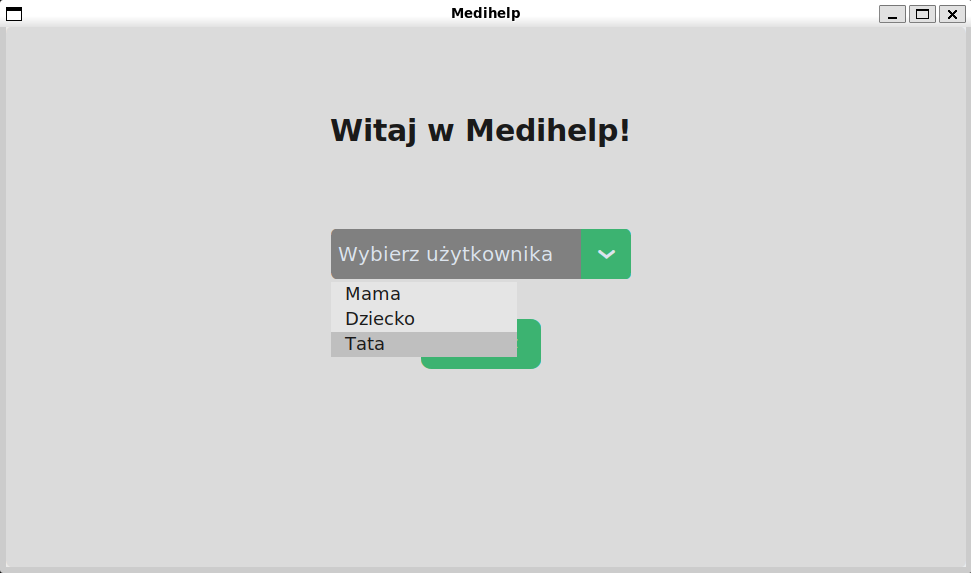
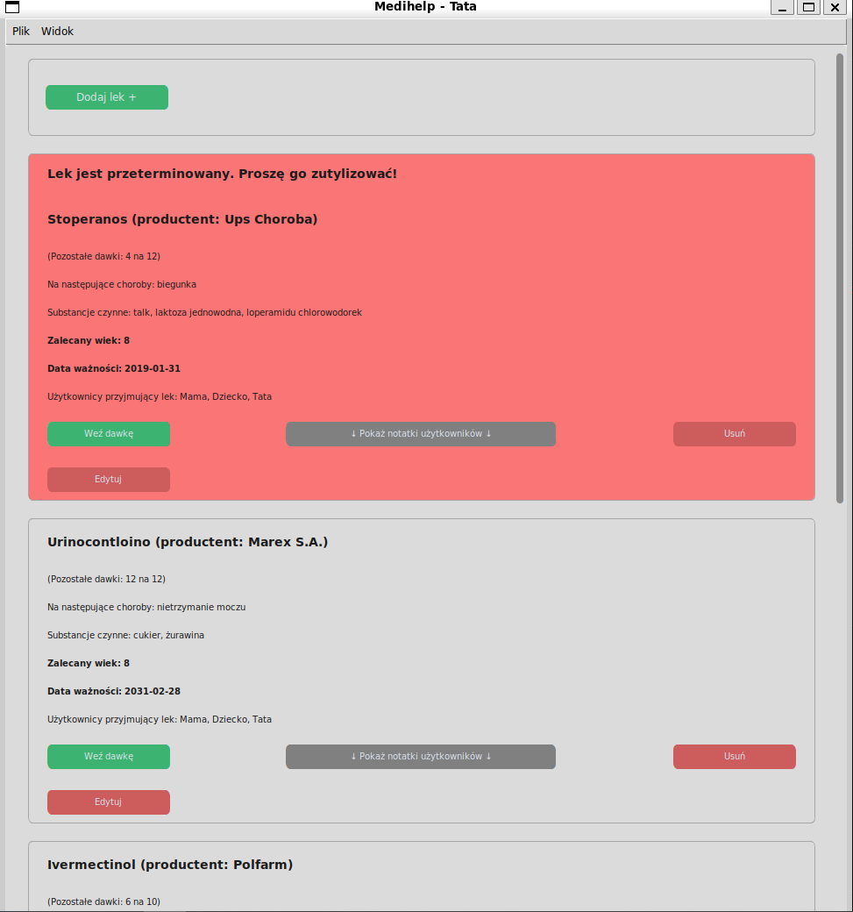
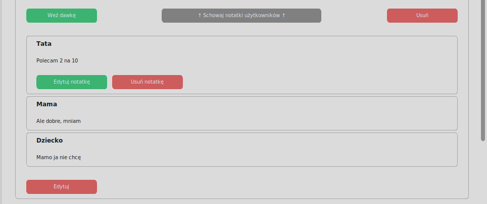
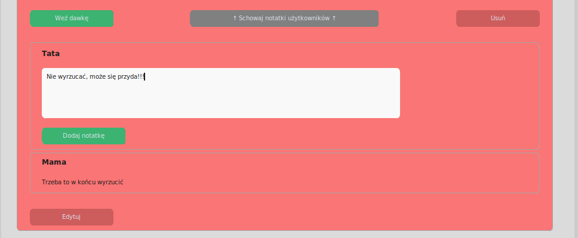
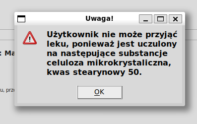
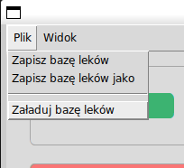
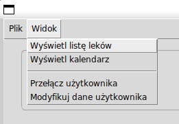
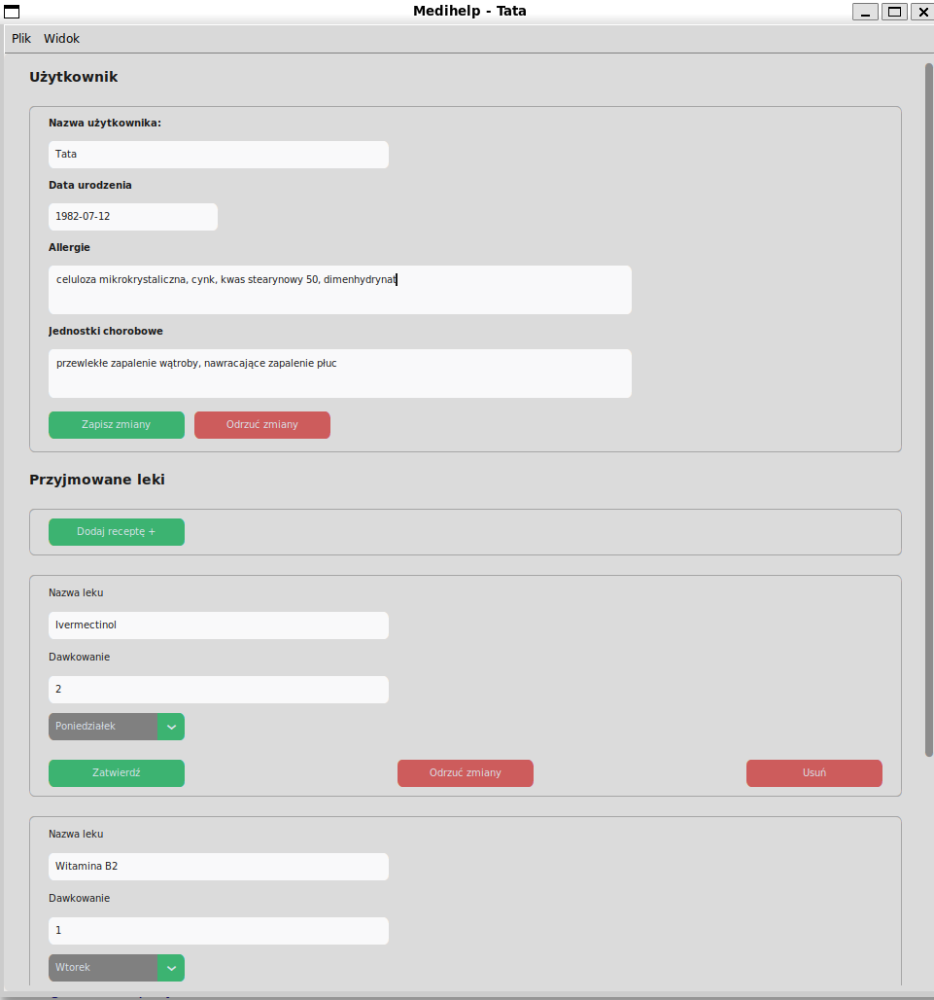

# Medihelp

## Autor

Mateusz Piasecki, nr. indeksu 337273

## Cel i opis projektu

Celem projektu jest opracowanie programu służącego do śledzenia stanu domowej apteczki. Należy założyć, że w gospodarstwie domowym są trzy osoby - mama, tata i dziecko. Każdy z leków powinien zawierać takie informacje jak:

- nazwa

- producent

- jednostki chorobowe (lista)

- dla kogo jest lek (mama, tata lub dziecko, może być więcej niż jedna osoba)

- substancje czynne

- zalecany wiek pacjenta

- liczba dawek w opakowaniu

- liczba dawek dostępnych (użytkownik może np. zużyć 2 z 10 tabletek z opakowania, w związku z czym zostaje 8 dawek)

- termin ważności

- notatka (użytkownik może do danego leku dodać swoją notatkę)

Program powinien zapewniać możliwość wczytywania i zapisywania bazy danych leków do pliku CSV.

Każda z osób z gospodarstwa domowego powinna zawierać takie informacje jak:

- imię (mama, tata, dziecko)

- wiek

- jednostki chorobowe

- uczulenie na substancje czynne

- przyjmowane leki wraz z dawkowaniem (jaki lek, dawka i dzień tygodnia)

Użytkownik programu powinien mieć możliwość dowolnej modyfikacji bazy danych apteczki domowej (dodawanie, usuwanie leków, zmiana poszczególnych zmiennych itp.). Dodatkowo przy każdym wywołaniu programu powinien on szukać w bazie leków przeterminowanych i przypominać o konieczności ich utylizacji. Program przy odpowiednim wywołaniu powinien również sprawdzić, czy dany lek jest bezpieczny dla danego domownika (użycie leku wyklucza np. uczulenie na jedną z substancji czynnych, czy też nieodpowiedni wiek) Program powinien zapewniać funkcjonalność wypisywania tygodniowego kalendarza przyjmowania leków dla każdego z uczestników.

## Podział programu na klasy

### 1) Klasy odpowiedzialne za logikę programu

-  **Prescription** - Klasa reprezentująca przyjmowany przez użytkownika lek. Obejmuje informacje takie jak nazwa leku, ilość dawek i dzień tygodnia.

-  **User** - Klasa, która obejmuje dane użytkownika takie jak ID, imię, datę urodzenia (na podstawie której można wyliczyć wiek), jednostki chorobowe, substancje na które użytkownik jest uczulony oraz przyjmowane leki (obiekty klasy Prescription).

-  **UsersDatabase** - Obejmuje słownik obiektów klasy User, gdzie kluczami są ID użytkowników oraz metody do ładowania danych o użytkownikach z pliku w formacje json oraz zapisywania danych o użytkownikach do pliku json.

-  **Medicine** - Klasa, która obejmuje informacje o leku takie jak ID, nazwa, producent, jednostki chorobowe, listę ID użytkowników dla których ten lek jest przeznaczony, substancje czynne, zalecany wiek pacjenta, liczba dawek w opakowaniu, liczba dostępnych dawek, termin ważności oraz słownik notatek użytkowników mapowanych po ID użytkowników (każdy użytkownik ma możliwość dodania jednej notatki do danego leku).

-  **MedicinesDatabase** - Obejmuje słownik obiektów klasy Medicine, gdzie kluczami są ID leków oraz metody do ładowania leków z pliku w formacje csv oraz zapisywania danych o lekach do pliku csv.

-  **System** - zapewnia metody, za pomocą których GUI komunikuje się z bazami danych użytkowników oraz leków.

### 2) Klasy Interfejsu graficznego

-  **GUI** - główna klasa interfejsu graficznego zarządzająca widokami oraz przechowująca ID użytkownika korzystającego, w danym momencie, z programu. Dziedziczy po klasie CTk biblioteki customtkinter, a więc jest oknem programu.

-  **MenuBar** - Klasa reprezentująca pasek menu na górze ekranu. Zawiera przyciski do zarządzania plikiem bazy danych leków (zapisz, załaduj itd.) oraz przełączania się między widokami. Dziedziczy po klasie Menu biblioteki klasy tkinter.

-  **View** - Klasa bazowa dla widoków programu. Dziedziczy po klasie CTkScrollableFrame biblioteki customtkinter.

-  **ChooseUserView** - Klasa reprezentująca widok startowy, pozwalający na wybór użytkownika.

-  **MedicineListView** - Klasa reprezentująca widok listy leków załadowanych z pliku. Pozwala na dodawanie nowych leków, modyfikację leków już istniejących, branie przez użytkownika dawek leków oraz dodawanie i modyfikowanie notatek.

-  **ModifyUserView** - Klasa reprezentująca widok pozwalający na modyfikację danych użytkownika obecnie korzystającego z programu.

-  **CalendarView** - Klasa reprezentująca widok tygodniowego kalendarza przyjmowania leków.

> Poniższe klasy dziedziczą po klasie CTkFrame biblioteki customtkinter.

-  **AddMedicineTile** - Klasa reprezentująca kafelek służący do dodawania leku, wyświetlany na górze widoku listy leków (MedicineListView).

-  **MedicineTile** - Klasa reprezentująca kafelek leku istniejącego. Wyświetla informacje o leku oraz dodane do nich notatki oraz pozwala na modyfikację zarówno notatek oraz informacji o leku. Wykorzystywany w widoku listy leków (MedicineListView)

-  **MedicineInfoTile** - Klasa składowa MedicineTile odpowiedzialna za wyświetlanie informacji o leku i notatek.

-  **MedicineEditTile** - Klasa składowa MedicineTile odpowiedzialna za interfejs modyfikacji danych leku.

-  **MedicineForm** - Klasa reprezentująca formularz pozwalający na wprowadzenie informacji o leku. Wykorzystywana w klasach MedicineEditTile i AddMedicineTile.

-  **AddNoteTile** - Klasa reprezentująca kafelek służący do dodawania nowych notatek do leku. Wykorzystywana wewnątrz klasy MedicineInfoTile.

-  **UserNoteTile** - Klasa reprezentująca kafelek notatki użytkownika. Wyświetla jej treść oraz pozwala na jej modyfikacje bądź usunięcie. Wykorzystywana wewnątrz klasy MedicineInfoTile.

-  **ModifyUserTile** - Klasa reprezentująca kafelek odpowiedzialny za wyświetlanie wszystkich danych użytkownika oprócz przyjmowanych leków oraz zapewnienie możliwości ich modyfikacji. Kafelek jest wykorzystywany w widoku modyfikacji użytkownika (ModifyUserView).

-  **AddPrescriptionTile** - Klasa reprezentująca kafelek służący do dodawania przyjmowanego leku do użytkownika. Wykorzystywana w widoku modyfikacji użytkownika (ModifyUserView).

-  **PrescriptionTile** - Klasa reprezentująca kafelek odpowiedzialny za wyświetlanie informacji o przyjmowanym leku oraz zapewnienie możliwości ich modyfikacji. Wykorzystywana w widoku modyfikacji użytkownika (ModifyUserView).

-  **PrescriptionForm** - Klasa reprezentująca formularz pozwalający na wprowadzenie informacji o przyjmowanym leku. Wykorzystywana w klasach PrescriptionTile i AddPrescriptionTile.

-  **Calendar** - Klasa reprezentująca kalendarz wyświetlany w widoku kalendarza (CalendarView).

-  **CalendarTile** - Kafelek odpowiedziany za wyświetlanie informacji o branym leku. Wykorzystywany w klasie Calendar.

## Instrukcja użytkowania

Program korzysta z plików ```users.json``` oraz ```medicines.csv ``` z katalogu ```data```. Pliki te zostały uzupełnione przykładowymi danymi

Aby uruchomić program należy wyjść do głównego katalogu projektu i wywołać komendę ```python3 app.py```
___
Po uruchomieniu programu, klienta przywita okno wyboru użytkownika.
<br/>
<br/>
*Widok wyboru użytkownika*


<br/>
<br/>
Po wyborze użytkownika z listy i zatwierdzeniu wyboru, program przełączy się na widok listy leków. Domyślnie program ładuje listę leków z pliku ```data/medicines.csv```.
<br/>
<br/>
*Widok listy leków*


<br/>
<br/>
Na samej górze widoku znajduje się kafelek służący do dodawania nowych leków. Po kliknięciu w przycisk ```Dodaj lek+``` pojawi się odpowiedni formularz.

Poniżej wyświetlają się kafelki z istniejącymi lekami. Na samej górze pojawią się leki przeterminowane, a ich kafelki mają czerwone tło i informację przypominającą o konieczności utylizacji.

Kafelki te umożliwiają klientowi edycję i usuwanie leków oraz wyświetlanie notatek dodanych przez użytkowników.

Klient może dodać własną notatkę, bądź edytować wcześniej dodaną. **Każdemu użytkownikowi przysługuje możliwość dodania maksymalnie jednej notatki do danego leku.**
<br/>
<br/>
*Notatki użytkownika do leku*


<br/>
<br/>
<br/>
*Możliwość dodania nowej notatki do leku*


<br/>
<br/>
Przycisk ```Weź dawkę``` sprawdza czy lek nie jest przeterminowany, czy użytkownik jest wpisany na listę biorców leku, czy użytkownik ma odpowiedni wiek oraz czy nie jest uczulony na żadną z substancji czynnych danego leku i jeśli wszystko jest w porządku to usuwa jedną dawkę danego leku. W przeciwnym wypadku pokazuje stosowne ostrzeżenie.
<br/>
<br/>
*Nieudana próba wzięcia dawki leku*


<br/>
<br/>
___
Na samej górze ekranu znajduje się pasek menu.
<br/>
<br/>
*Menu Pliku*


<br/>
<br/>
- Opcje ```zapisz bazę leków``` oraz ```zapisz bazę leków jako``` służą

do zapisywania zmian wprowadzonych przez klienta. **Uwaga!!! zmiany

dotyczące leków nie zapisują się automatycznie!**

- Opcja ```Załaduj

bazę leków``` pozwala załadować inny niż domyślny

(```data/medicines.csv```) plik z bazą danych leków.
<br/>
<br/>
*Menu Widoku*


<br/>
<br/>
Menu ```Widok``` pozwala użytkownikowi na przełączanie się między widokami listy leków, tygodniowego kalendarza przyjmowania leków oraz modyfikacji danych użytkownika. Pozwala również na powrót do widoku wyboru użytkownika.
___
Na szczególną uwagę zasługuje widok modyfikacji użytkownika.
<br/>
<br/>
*Widok modyfikacji użytkownika*


<br/>
<br/>
Na górze tego widoku znajduje się formularz z danymi użytkownika, które można edytować. Po kliknięciu przycisku ```zapisz zmiany``` zostaną one zapisane w pliku ```data/users.json```  **Nie zaleca się manualnej modyfikacji tego pliku!**

Poniżej znajduje się lista leków przyjmowanych przez użytkownika, którą można dowolnie modyfikować.

**Uwaga!!! Wszelkie zatwierdzone zmiany w widoku modyfikacji użytkownika zapisują się automatycznie, a więc są nieodwracalne!**
___
<br/>
<br/>
*Widok kalendarza*


<br/>
<br/>
W widoku kalendarza wyświetla się tygodniowy kalendarz przyjmowanych leków poszczególnych użytkowników lub wszystkich użytkowników wedle wyboru klienta.

**Uwaga!!! Wszystkie formularze pozwalające na wprowadzanie zmian czy to w bazie danych leków czy użytkowników są kontrolowane pod względem poprawności wprowadzonych danych przed zatwierdzeniem zmian i wyświetlają odpowiednie informacje o błędach jeśli nie udało się zatwierdzić zmian.**

Ograniczenia dotyczące wprowadzanych danych:

- Notatka może mieć maksymalnie 500 znaków oraz 5 linii.
- Nazwy użytkownika, leku czy producenta mogą mieć maksymalnie 16 znaków i nie mogą być puste.
- Żadne nazwy zarówno te wspomniane wyżej jak i nazwy substancji nie mogą zawierać następujących znaków: ```'```, ```"```, ```,```, ```Znak nowej linii```

## Refleksje i dodatkowe informacje

Projekt udało mi się zrealizować zgodnie z pierwotnymi założeniami praktycznie od początku do końca. Nie natrafiłem na żadne szczególne problemy.

Chciałbym jednak zwrócić uwagę na kilka aspektów:

- Po pierwsze, program zgodnie z poleceniem zakłada, że w gospodarstwie domowym są trzy osoby - Mama, Tata i Dziecko. Ilość użytkowników zależy jednak tylko i wyłącznie od ich ilości w pliki ```data/users.json```, a więc łatwo jest go rozszerzyć o opcje dodawania oraz usuwania użytkowników. Aby to zrobić nie trzeba modyfikować istniejącego już kodu.
- Po drugie, inaczej niż w poleceniu, zamiast wieku użytkownika, program zapisuję datę urodzenia i na jej podstawie wylicza wiek. Uznałem, że takie rozwiązanie jest bardziej eleganckie.